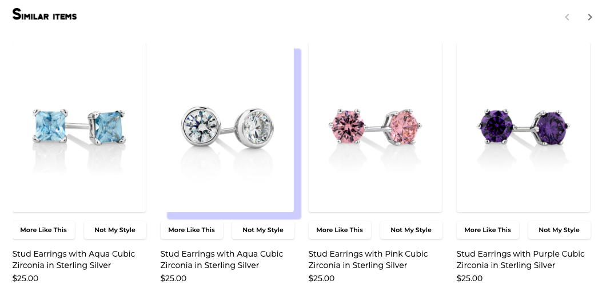

# Styling Product Recommender

Some basic styling for the Product Recommender can be done in the Skafos Product Recommendations App Dashboard such as selecting a font the app should use or changeing the text copy of the header and buttons. In addition to that, we allow you to set styles by inserting them into the head element of the page. You can completely make it your own using CSS. If you are familiar with CSS, you can inspect the page to discover all the styles you are able to overwrite. We are using Material-UI under the hood, so if you know the [global class names](https://mui.com/customization/how-to-customize/#5-global-css-override), you can also directly overwrite material components' styles.

Here is an overview of the layout and some examples of customization. We will walk through styling examples on how to style this to make it completely your own. Here is what the default Recommender looks like:


## The Basics
Style modifications are done by inserting a `<style>` element into the head content in the dashboard. This is what a style element looks like:

```html
<style>
</style>
```

## Fonts
To add a font to the page you can import a font like this. Here as an example, I'm importing the [Zen Tokyo Zoo](https://fonts.google.com/specimen/Zen+Tokyo+Zoo) Font. We can just copy pasted the code provided by Google:

```html
<style>
@import url('https://fonts.googleapis.com/css2?family=Zen+Tokyo+Zoo&display=swap');
</style>
```

Next, we need to apply this font to some sections of the page. Let's say, I want to apply it to all the titles:

```html
<style>
@import url('https://fonts.googleapis.com/css2?family=Zen+Tokyo+Zoo&display=swap');

h1, h2, h3, h4, h5, h6 {
    font-family: 'Zen Tokyo Zoo', cursive !important;
}
</style>
```

Let's see what this does:


## Layout

Here is the basic layout of the page with the css class names for each section


It contains three main sections
- A header (skafos-discovery-header)
- The product grid (skafos-product-grid)
- The product card (skafos-animated-product-card)

Here are some simple examples of custom styling:

**Image**
Let's try changing the hover effect to the product image

```html
<style>
.skafos-image-container:hover {
  box-shadow: 12px 12px 2px 1px rgba(0, 0, 255, .2);
}
```

Let's see what that does:
 

**Buttons**
Let's try changing the background and hover color to the buttons

```html
<style>
.skafos-interaction-button {
  background-color: aqua;
}

.skafos-interaction-button:hover {
  background-color: aquamarine;
  color: black;
}
</style>
```
Let's see what that does:


**Description and Price**
Let's make the description and price a different style

```html
<style>
.skafos-product-description {
  font-style: italic;
  color: darkcyan;
}

.skafos-product-price {
  font-weight: 700;
  color: blueviolet;
}
</style>
```

Let's see what that looks like:


## Putting it all together
Here are all the styles above put together:
```html
<style>
@import url('https://fonts.googleapis.com/css2?family=Zen+Tokyo+Zoo&display=swap');

h1, h2, h3, h4, h5, h6 {
    font-family: 'Zen Tokyo Zoo', cursive !important;
}

.skafos-image-container:hover {
  box-shadow: 12px 12px 2px 1px rgba(0, 0, 255, .2);
}

.skafos-interaction-button {
  background-color: aqua;
}

.skafos-interaction-button:hover {
  background-color: aquamarine;
  color: black;
}

.skafos-product-description {
  font-style: italic;
  color: darkcyan;
}

.skafos-product-price {
  font-weight: 700;
  color: blueviolet;
}
</style>
```
