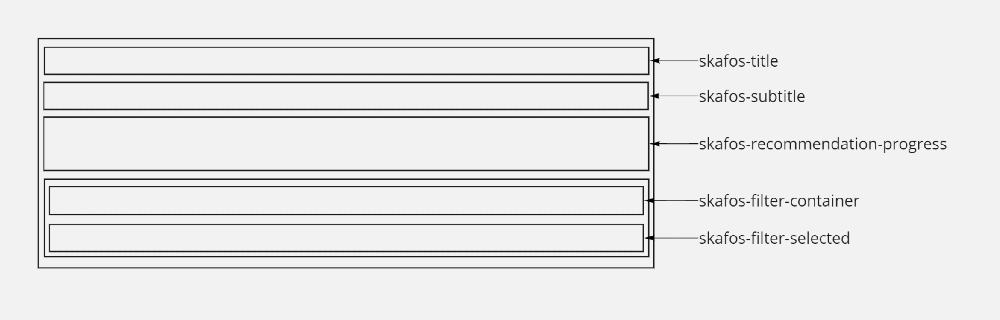
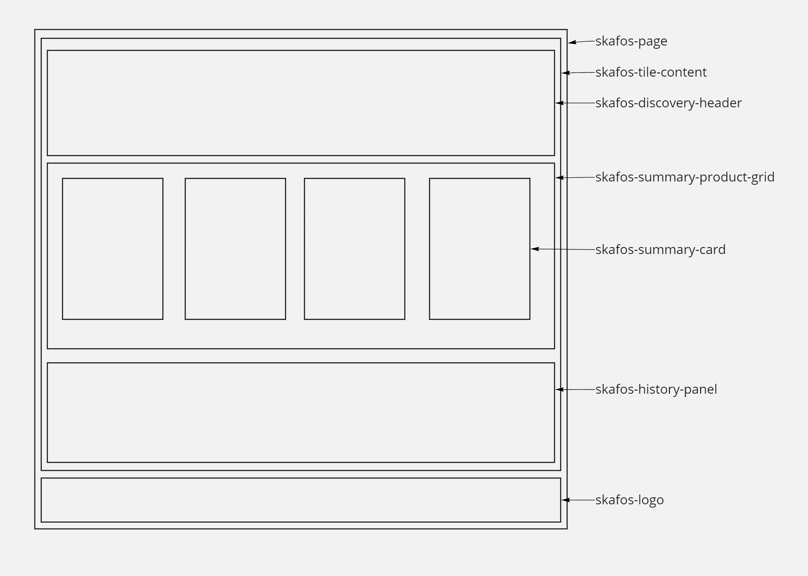
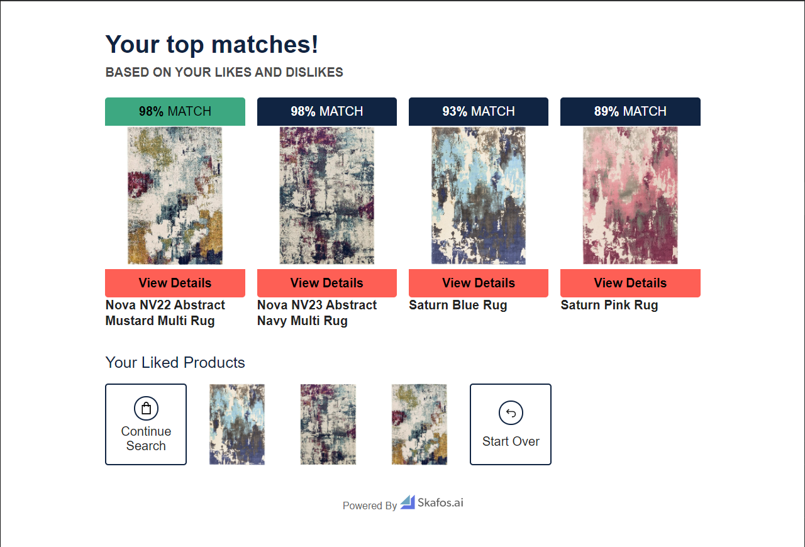
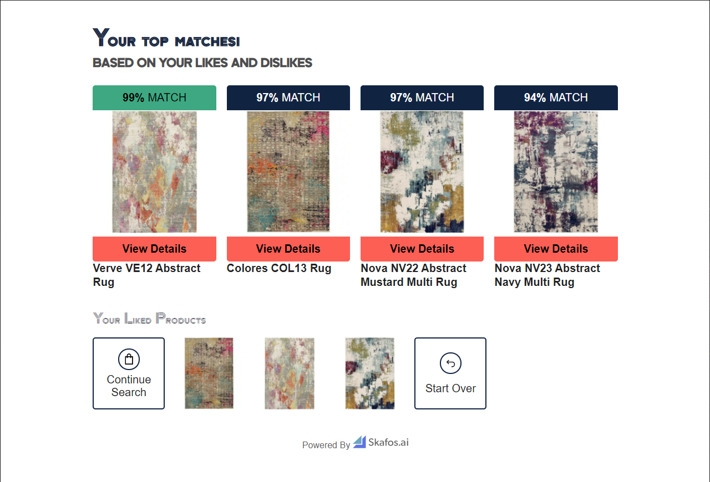
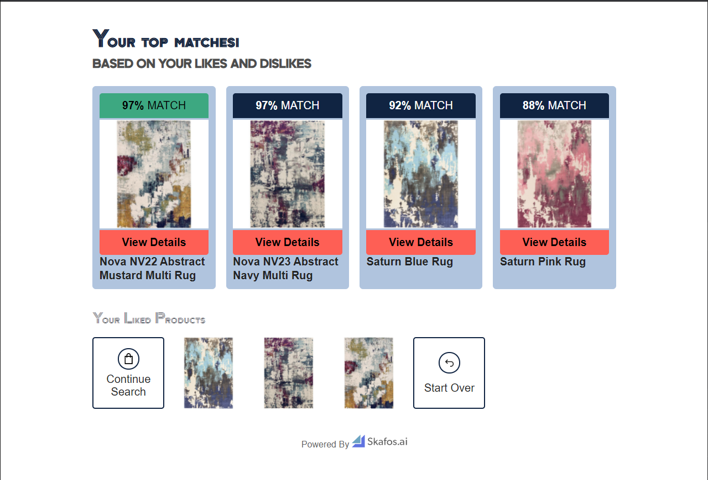
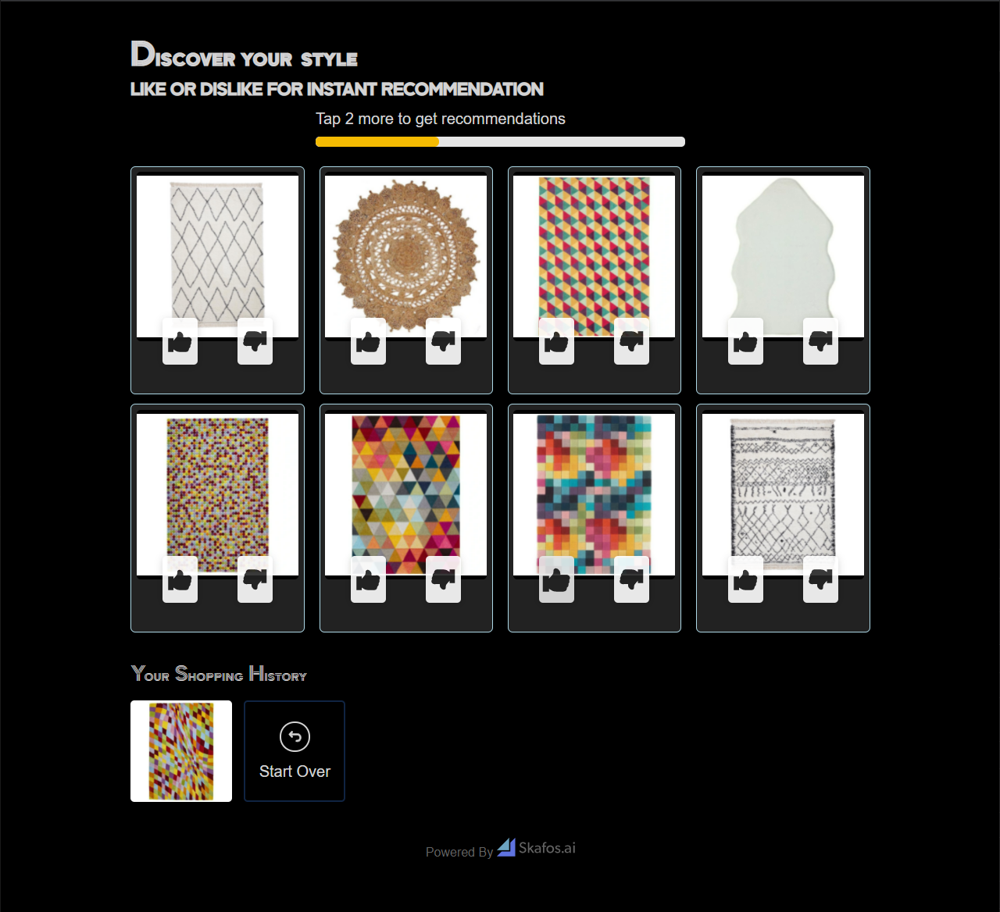

# Styling Tileapp

Some basic styling for our app, which we call "Tileapp", can be done in the Skafos Product Recommendations App Dashboard such as selecting a basic set of colors and choosing from a list of fonts. In addition to that, we allow you to set styles by inserting them into the head element of the page. You can completely make it your own using CSS. If you are familiar with CSS, you can inspect the page to discover all our styles. 

Here is an overview of the layout and some examples of customization. We will walk through styling examples on how to style this to make it completely your own. Here is what the default TileApp looks like:


## The Basics
Style modifications are done by inserting a `<style>` element into the head content in the dashboard. This is what a style element looks like:

```html
<style>
</style>
```

### Fonts
To add a font to the page you can import a font like this. Here as an example, I'm importing the [Zen Tokyo Zoo](https://fonts.google.com/specimen/Zen+Tokyo+Zoo) Font. We can just copy pasted the code provided by Google:

```html
<style>
@import url('https://fonts.googleapis.com/css2?family=Zen+Tokyo+Zoo&display=swap');
</style>
```

Next, we need to apply this font to some sections of the page. Let's say, I want to apply it to all titles. I added `!important` to the code that Google provided in the CSS rules so that it will override any other font set from other styles.

```html
<style>
@import url('https://fonts.googleapis.com/css2?family=Zen+Tokyo+Zoo&display=swap');

h1, h2, h3, h4, h5, h6 {
    font-family: 'Zen Tokyo Zoo', cursive !important;
}
</style>
```

Let's see what this does:


### Pages

The Skafos Tileapp experience consists of two main pages:
- The Discovery Page: This is where the user upvotes or downvotes Products
- The Summary Page: This is where the user is provided with Recommendations

While the structure of the pages is similar, they are a bit different. So will look at them individually.

## Discovery Page

Here is the basic layout of the discovery page with the css class names for each section


All the content is inside the `skafos-tile-content` block. It contains three sections
- A Header (skafos-discovery-header)
- The Product Grid (skafos-tiles-product-grid)
- History Panel (skafos-history-panel)

### Header
Here is the layout of the header:


The header contains four sections:
- Title (skafos-title)
- Subtitle (skafos-subtitle)
- Recommendation Progress (skafos-recommendation-progress)
- Filters - This feature is coming soon

### Product Grid
The product grid contains product cards. 8 cards on desktop and 4 on mobile.

#### Product cards
Here is the layout of the product card:


The container for the product card contains two cards, one visible and one hidden to power the flip animation. Each of those contains four sections:
- Top Content - This is currently empty and the option to display price at the top is in the works
- Image container
- Interactions - this contains the two buttons to upvote and downvote
- Bottom Content - By default this contains the price of the product. Options to hide the price and show the name are in the works.

Here are some simple examples of styling a product card:

**Border**
```html
<style>
.skafos-styled-tiles-product {
    border: 1px solid lightblue;
    border-radius: 5px;
}
</style>
```

Let's see what that does:
 

Things look too close to the border, let's add some padding:
```html
<style>
.skafos-styled-tiles-product {
    border: 1px solid lightblue;
    border-radius: 5px;
    padding: 5px;
}
</style>
```

Let's see what that does:


**Background Color**
Let's try adding a background to the cards

```html
<style>
.skafos-styled-tiles-product, .skafos-animated-product-card {
    background-color: lightsteelblue;
}
</style>
```
Let's see what that does:


Now let's put our borders and background together:
```html
<style>
.skafos-styled-tiles-product {
    border: 1px solid lightblue;
    border-radius: 5px;
    padding: 5px;
}

.skafos-styled-tiles-product, .skafos-animated-product-card {
    background-color: lightsteelblue;
}
</style>
```

Let's see what that looks like:


**Price**
Let's make the price bold and a different color. The price is in a container with class `skafos-custom-price`.

```html
<style>
.skafos-custom-price {
    color: darkblue;
    font-weight: bold;
}
</style>
```

Let's see what that looks like:


### Putting it all together
Here are all the styles above put together:
```html
<style>
@import url('https://fonts.googleapis.com/css2?family=Zen+Tokyo+Zoo&display=swap');

h1, h2, h3, h4, h5, h6 {
    font-family: 'Zen Tokyo Zoo', cursive !important;
}

.skafos-styled-tiles-product {
    border: 1px solid lightblue;
    border-radius: 5px;
    padding: 5px;
}

.skafos-styled-tiles-product, .skafos-animated-product-card {
    background-color: lightsteelblue;
}

.skafos-custom-price {
    color: darkblue;
    font-weight: bold;
}
</style>
```

Here is what the page looks like:


## Summary Page

Here is the basic layout of the summary page with the css class names for each section


As you can see, most of the layout is pretty similar. The main difference is the product grid. On the discovery page, the grid is replaced with a new different one. In the header, there are only two sections, the title and subtitle.

This is what the default summary page looks like:


Let's try and apply all our previous styles to this page. This is what we get:


We can see it didn't apply the tile background. That's because the summary page has a different product card. Let's try and apply our background properties here.

```css
.skafos-summary-card {
    background-color: lightsteelblue;
    padding: 10px;
    border-radius: 5px;
}
```

This is what happened:


## Putting it All Together

Let's try to use all the above and some other things found from instpecting that page to make a dark theme
```html
<style>
@import url('https://fonts.googleapis.com/css2?family=Zen+Tokyo+Zoo&display=swap');

* {
    color: lightgrey;
}

body, .skafos-tiles-product-grid, .skafos-summary-product-grid, .skafos-product-image, .skafos-product-card {
    background-color: black;
}

h1, h2, h3, h4, h5, h6 {
    font-family: 'Zen Tokyo Zoo', cursive !important;
    color: lightgrey !important;
}

.skafos-styled-tiles-product {
    border: 1px solid lightblue;
    border-radius: 5px;
    padding: 5px;
}

.skafos-styled-tiles-product, .skafos-animated-product-card {
    background-color: #222;
}

.skafos-custom-price {
    color: skyblue;
    font-weight: bold;
}

.skafos-summary-card {
    background-color: #222;
    padding: 10px;
    border-radius: 5px;
}

.skafos-icon {
    stroke: lightgrey !important;
    color: lightgrey !important;
    fill: lightgrey !important;
    stroke-width: 1;
}

.skafos-icon path {
    stroke: lightgrey !important;
    color: lightgrey !important;
    fill: lightgrey !important;
    stroke-width: 1;
}

.skafos-like-icon {
    stroke: #222 !important;
    color: #222 !important;
    fill: #222 !important;
}

.skafos-like-icon path {
    stroke: #222 !important;
    color: #222 !important;
    fill: #222 !important;
}

.skafos-dislike-icon {
    stroke: #222 !important;
    color: #222 !important;
    fill: #222 !important;
}

.skafos-dislike-icon path {
    stroke: #222 !important;
    color: #222 !important;
    fill: #222 !important;
}

.skafos-icon-circle-border {
    border-color: lightgrey !important;
}

.skafos-product-name {
    color: lightgrey;
}

.skafos-loading-tiles {
    background: transparent !important;
}

.skafos-popup-container {
    background-color: #222 !important;
}

.skafos-ok-btn {
    background-color: darkgrey !important;
}
</style>
```

Notice that all our icons are svg files and you can easily change the color for them globally or individually! Here is what this dark theme looks like:


