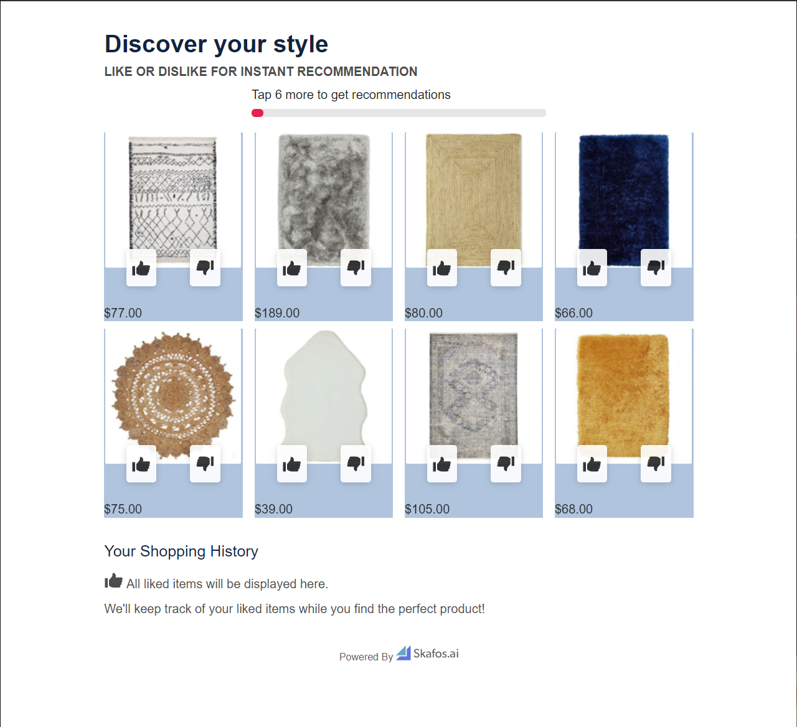

# Styling Tileapp

Some basic styling for our app, which we call "Tileapp" can be done in the Skafos Product Recommendations App Dashboard such as selecting a basic set of colors and choosing from a list of fonts. However, we allow you to set styles by inserting them into the `head` element of the page. You can completely make it your own using CSS. If you are familiar with CSS, you can inspect the page to discover all our styles. Here is an overview of the layout and some examples of customization.

Here is what the default TileApp looks like. We will walk through styling examples on how to style this to make it completely your own:


## The Basics
Style modifications are done by inserting a `<style>` element into the head content in the dashboard. This is what a style element looks like:

```html
<style>
</style>
```

### Fonts
To add a font to the page you can import a font like this. Here as an example, I'm importing the [Zen Tokyo Zoo](https://fonts.google.com/specimen/Zen+Tokyo+Zoo) Font. We can just copy pasted the code provided by Google:

```html
<style>
@import url('https://fonts.googleapis.com/css2?family=Zen+Tokyo+Zoo&display=swap');
</style>
```

Next, we need to apply this font to some sections of the page. Let's say, I want to apply it to all titles. I added `!important` to the code that Google provided in the CSS rules so that it will override any other font set from other styles.

```html
<style>
@import url('https://fonts.googleapis.com/css2?family=Zen+Tokyo+Zoo&display=swap');

h1, h2, h3, h4, h5, h6 {
    font-family: 'Zen Tokyo Zoo', cursive !important;
}
</style>
```

Let's see what this does:


### Colors


## Discovery Page

Here is the basic layout of the discovery page with the css class names for each section


All the content is inside the `skafos-tile-content` block. It contains three sections
- A Header
- The Product Grid 
- History Panel

### Header
The header contains four sections:
- Title
- Subtitle
- Recommendation Progress
- Filters

### Product Grid
The product grid contains product cards. 8 cards on desktop and 4 on mobile.

#### Product cards
Here is the layout of the product card:


The container for the product card contains two cards, one visible and one hidden to power the flip animation. Each of those contains four sections:
- Top Content - This is currently empty and the option to display price at the top is in the works
- Image container
- Interactions - this contains the two buttons to upvote and downvote
- Bottom Content - By default this contains the price of the product. Options to hide the price and show the name are in the works.

Here are some simple examples of styling a product card:

**Border**
```html
<style>
.skafos-styled-tiles-product {
    border: 1px solid lightblue;
    border-radius: 5px;
}
</style>
```

Let's see what that does:
 

Things look too close to the border, let's add some padding:
```html
<style>
.skafos-styled-tiles-product {
    border: 1px solid lightblue;
    border-radius: 5px;
    padding: 5px;
}
</style>
```

Let's see what that does:


**Background Color**
Let's try adding a background to the cards

```html
<style>
.skafos-styled-tiles-product, .skafos-animated-product-card {
    background-color: lightsteelblue;
}
</style>
```
Let's see what that does:


Now let's put our borders and background together:
```html
<style>
.skafos-styled-tiles-product {
    border: 1px solid lightblue;
    border-radius: 5px;
    padding: 5px;
}

.skafos-styled-tiles-product, .skafos-animated-product-card {
    background-color: lightsteelblue;
}
</style>
```

Let's see what that looks like:


**Price**
Let's make the price bold and a different color. The price is in a container with class `skafos-custom-price`.

```html
<style>
.skafos-custom-price {
    color: darkblue;
    font-weight: bold;
}
</style>
```

Let's see what that looks like:


### Putting it all together
Here are all the styles above put together:
```html
<style>
@import url('https://fonts.googleapis.com/css2?family=Zen+Tokyo+Zoo&display=swap');

h1, h2, h3, h4, h5, h6 {
    font-family: 'Zen Tokyo Zoo', cursive !important;
}

.skafos-styled-tiles-product {
    border: 1px solid lightblue;
    border-radius: 5px;
    padding: 5px;
}

.skafos-styled-tiles-product, .skafos-animated-product-card {
    background-color: lightsteelblue;
}

.skafos-custom-price {
    color: darkblue;
    font-weight: bold;
}
</style>
```

Here is what the page looks like:
